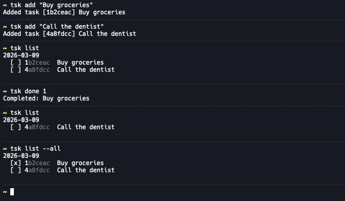

# tsk

A minimal command-line task manager for personal use.



## Installation

Requires [pipx](https://pipx.pypa.io/stable/installation/). From the repository root, run:

```
pipx install .
```

This installs the package in an isolated environment and makes the `tsk` command available globally in your shell.

## Usage

```
tsk add "Buy groceries"   # create a task
tsk list                  # show open tasks
tsk done a3f              # mark a task done (partial ID works)
```

Run `tsk --help` or `tsk <command> --help` for all available commands and options.

## Storage

Tasks are saved as a plain Markdown file at `~/.tsk/tasks.md`, which you can read and back up like any other file.
